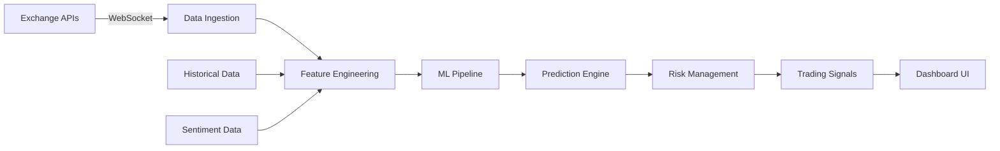

<div align="center">

# 🚀 Real-Time Crypto ML Trading Pipeline

<div align="center">


<h3>An intelligent, real-time cryptocurrency trading system using Random Forest ML and WebSocket streaming</h3>

<div align="center">

## 🎮 Live Demo

<p align="center">
  <a href="https://rosalinatorres888.github.io/crypto-ml-pipeline/">
    
  </a>
</p>


</div>

---

## 🎯 Project Overview

This project demonstrates a production-ready machine learning pipeline for cryptocurrency trading, combining **real-time data streaming**, **ensemble learning algorithms**, and **interactive visualization**. Building with scalability and performance in mind, it showcases modern data engineering and ML practices.


## 💼 Skills Demonstrated

<table>
<tr>
<td width="33%">

### 🤖 Machine Learning
- Random Forest Ensemble
- Feature Engineering
- Real-time Model Inference
- Hyperparameter Optimization
- Model Interpretability (SHAP)

</td>
<td width="33%">

### 📊 Data Engineering
- WebSocket Streaming
- Pandas Data Processing
- Time Series Analysis
- Data Pipeline Architecture
- Real-time ETL

</td>
<td width="33%">

### 💻 Software Engineering
- Clean Code Practices
- Docker Containerization
- REST API Design
- Interactive Dashboards
- Unit Testing

</td>
</tr>
</table>

## 🔥 Key Features

### 1. Real-Time Data Streaming
```python
# WebSocket connection to multiple exchanges
async def stream_prices(self):
    async with websockets.connect(self.ws_url) as websocket:
        async for message in websocket:
            await self.process_tick(json.loads(message))
```

### 2. Intelligent Feature Engineering
- **Technical Indicators**: RSI, MACD, Bollinger Bands
- **Market Microstructure**: Order flow imbalance, bid-ask spread
- **Sentiment Analysis**: Social media sentiment integration
- **On-chain Metrics**: Whale movements, exchange flows

### 3. Random Forest ML Model
```python
# Ensemble learning for robust predictions
self.model = RandomForestClassifier(
    n_estimators=200,
    max_depth=20,
    min_samples_split=5,
    n_jobs=-1  # Parallel processing
)
```

### 4. Interactive Dashboard
- **Live price charts** with Chart.js
- **Real-time predictions** with confidence scores
- **Performance metrics** tracking
- **Trade execution simulation**

## 🏗️ System Architecture (in progress...)



## 🚀 Getting Started

### Prerequisites
- Python 3.9+
- Docker (optional)
- API keys for crypto exchanges

### Quick Installation

```bash
# Clone the repository
git clone https://github.com/rosalinatorres888/crypto-ml-pipeline.git
cd crypto-ml-pipeline

# Create virtual environment
python -m venv venv
source venv/bin/activate  # On Windows: venv\Scripts\activate

# Install dependencies
pip install -r requirements.txt

# Set up environment variables
cp .env.example .env
# Edit .env with your API keys

# Run the pipeline
python main.py
```


## 🧪 Testing & Validation

```bash
# Run unit tests
pytest tests/

# Run backtesting
python backtest.py --start-date 2024-01-01 --end-date 2024-12-31

# Performance profiling
python -m cProfile -s cumulative main.py
```


## 🛠️ Technical Stack

<div align="center">


</div>


## 🗺️ Roadmap

### Phase 1 (Current) ✅
- [x] WebSocket integration
- [x] Random Forest implementation
- [x] Basic dashboard

### Phase 2 (In Progress) 🚧
- [ ] LSTM time series prediction
- [ ] Multi-exchange arbitrage
- [ ] Advanced risk management
- [ ] Mobile app

### Phase 3 (Planned) 📋
- [ ] Reinforcement learning agent
- [ ] Kubernetes orchestration
- [ ] GraphQL API
- [ ] Blockchain integration

## 📚 Documentation

- [Full Documentation](docs/README.md)
- [API Reference](docs/api.md)
- [Architecture Decisions](docs/architecture.md)
- [ML Model Details](docs/ml-models.md)


## 📬 Contact

**Rosalina Torres** - [@rosalinatorres888](https://github.com/rosalinatorres888)

- 💼 [LinkedIn](https://linkedin.com/in/rosalina2)
- 📧 torres.ros@northeastern.edu


## 📄 License

This project is licensed under the MIT License - see the [LICENSE](LICENSE) file for details.

## 🙏 Acknowledgments

- Thanks to the open-source community
  
---

<div align="center">

### ⭐ If you found this project interesting, please consider giving it a star!

<b>Built with ❤️ by Rosalina Torres</b>

</div>
