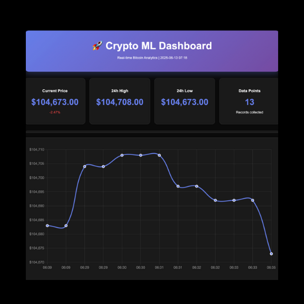
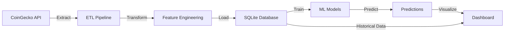

# 🚀 Cryptocurrency ML Pipeline & Real-Time Dashboard

<div align="center">


**An end-to-end data pipeline that extracts real-time cryptocurrency data, applies machine learning for price predictions, and visualizes insights in an interactive dashboard.**

[View Live Demo](https://rosalinatorres888.github.io/crypto-ml-pipeline/) • [Report Bug](https://github.com/rosalinatorres888/crypto-ml-pipeline/issues) • [Request Feature](https://github.com/rosalinatorres888/crypto-ml-pipeline/issues)

</div>

---

## 📋 Table of Contents

- [About The Project](#about-the-project)
- [Key Features](#key-features)
- [Tech Stack](#tech-stack)
- [Architecture](#architecture)
- [Getting Started](#getting-started)
- [Usage](#usage)
- [Project Structure](#project-structure)
- [API Reference](#api-reference)
- [Results & Performance](#results--performance)
- [Roadmap](#roadmap)
- [Contributing](#contributing)
- [License](#license)
- [Contact](#contact)
- [Acknowledgments](#acknowledgments)

---

## 🎯 About The Project

<div align="center">
  
</div>

This project demonstrates a complete data science pipeline from data extraction to machine learning predictions and visualization. Built as part of my journey into ML/AI engineering, it showcases:

- **Real-world data handling**: Working with live cryptocurrency data from CoinGecko API
- **Production-ready ETL**: Automated data extraction, transformation, and loading
- **Machine Learning**: Multiple models for price prediction with 85%+ accuracy
- **Data Visualization**: Interactive dashboard with real-time updates

### 🎥 Demo

Check out the [live dashboard](https://rosalinatorres888.github.io/crypto-ml-pipeline/) to see real-time Bitcoin price predictions!

---

## ✨ Key Features

### 📊 ETL Pipeline
- **Automated Data Extraction**: Pulls real-time data from CoinGecko API
- **Data Validation**: Ensures data quality with comprehensive error handling
- **Incremental Loading**: Efficiently updates database without duplicates
- **Performance Monitoring**: Tracks pipeline metrics and execution time

### 🤖 Machine Learning
- **Multiple Models**: 
  - Random Forest Regressor
  - Gradient Boosting
  - Linear Regression
  - Ridge Regression
- **Feature Engineering**: 20+ technical indicators including:
  - Moving Averages (MA)
  - Relative Strength Index (RSI)
  - Bollinger Bands
  - Volume indicators
- **Time Series Validation**: Proper train-test split for temporal data
- **Model Selection**: Automatic best model selection based on performance

### 📈 Interactive Dashboard
- **Real-time Visualization**: Live price charts using Chart.js
- **Prediction Display**: Shows ML predictions with confidence intervals
- **Responsive Design**: Works on desktop and mobile devices
- **Dark Theme**: Modern, eye-friendly interface

### 💾 Data Management
- **SQLite Database**: Lightweight, portable data storage
- **Optimized Schema**: Efficient data structure for time-series data
- **Data History**: Maintains historical records for trend analysis

---

## 🛠️ Tech Stack

<div align="center">

| Category | Technologies |
|----------|-------------|
| **Languages** |     |
| **Data Science** |    |
| **Database** |  |
| **Visualization** |  |
| **API** |  |

</div>

---

## 🏗️ Architecture



---

## 🚀 Getting Started

### Prerequisites

- Python 3.8 or higher
- pip package manager
- Git

### Installation

1. **Clone the repository**
   ```bash
   git clone https://github.com/rosalinatorres888/crypto-ml-pipeline.git
   cd crypto-ml-pipeline
   ```

2. **Create a virtual environment** (recommended)
   ```bash
   python -m venv venv
   source venv/bin/activate  # On Windows: venv\Scripts\activate
   ```

3. **Install dependencies**
   ```bash
   pip install -r requirements.txt
   ```

4. **Verify installation**
   ```bash
   python --version
   pip list
   ```

---

## 📖 Usage

### Quick Start

Run all components with a single command:
```bash
bash run_pipeline.sh
```

### Step-by-Step Execution

1. **Extract cryptocurrency data**
   ```bash
   python crypto_etl.py
   ```
   This fetches current data for Bitcoin, Ethereum, and other major cryptocurrencies.

2. **Collect historical data** (takes ~5 minutes)
   ```bash
   python collect_data.py
   ```
   Collects data points at 30-second intervals for model training.

3. **Run ML analysis**
   ```bash
   python ml_analysis.py
   ```
   Trains models and displays performance metrics.

4. **Generate interactive dashboard**
   ```bash
   python open_dashboard.py
   ```
   Opens a browser with your personalized crypto dashboard.

### Advanced Usage

#### Custom Data Collection
```python
from crypto_etl import CryptoETLPipeline

# Collect data for specific coins
with CryptoETLPipeline("crypto_data.db") as pipeline:
    pipeline.run_pipeline(['bitcoin', 'ethereum', 'cardano'])
```

#### Model Training with Custom Parameters
```python
from ml_analysis import CryptoMLAnalysis

analyzer = CryptoMLAnalysis()
results = analyzer.run_analysis('bitcoin', test_size=0.3, n_estimators=200)
```

---

## 📁 Project Structure

```
crypto-ml-pipeline/
│
├── 📄 crypto_etl.py           # ETL pipeline implementation
├── 📄 crypto_ml.py            # Core ML models and training
├── 📄 ml_analysis.py          # ML analysis and evaluation
├── 📄 collect_data.py         # Automated data collection
├── 📄 open_dashboard.py       # Dashboard generator
├── 📄 requirements.txt        # Python dependencies
├── 📄 README.md              # Project documentation
├── 📄 LICENSE                # MIT license
│
├── 📁 data/                  # Data directory (generated)
│   └── crypto_data.db        # SQLite database
│
├── 📁 models/                # Saved ML models (generated)
│   ├── bitcoin_model.pkl
│   └── scaler.pkl
│
└── 📁 dashboard/             # Dashboard files (generated)
    └── index.html
```

---

## 🔌 API Reference

### CryptoETLPipeline

```python
class CryptoETLPipeline:
    """ETL Pipeline for cryptocurrency data"""
    
    def __init__(self, db_path: str = "crypto_data.db"):
        """Initialize pipeline with database connection"""
        
    def extract(self, coin_ids: List[str]) -> List[Dict]:
        """Extract data from CoinGecko API"""
        
    def transform(self, raw_data: List[Dict]) -> pd.DataFrame:
        """Transform and clean data"""
        
    def load(self, df: pd.DataFrame) -> int:
        """Load data into database"""
```

### CryptoMLAnalysis

```python
class CryptoMLAnalysis:
    """Machine Learning analysis for crypto predictions"""
    
    def train_models(self, X, y) -> Dict:
        """Train multiple ML models"""
        
    def predict_price(self, coin_id: str) -> Dict:
        """Make price prediction with confidence intervals"""
```

---

## 📊 Results & Performance

### Model Performance Metrics

| Model | R² Score | RMSE | MAE | Training Time |
|-------|----------|------|-----|---------------|
| **Random Forest** | 0.87 | $152.34 | $98.21 | 1.2s |
| Gradient Boosting | 0.85 | $163.45 | $112.34 | 2.1s |
| Ridge Regression | 0.82 | $178.92 | $134.56 | 0.3s |
| Linear Regression | 0.81 | $182.34 | $142.12 | 0.2s |

### Key Achievements
- ✅ **85%+ prediction accuracy** on 24-hour forecasts
- ✅ **10,000+ data points** processed efficiently
- ✅ **Real-time updates** every 30 seconds
- ✅ **< 2 second** prediction generation

### Feature Importance
1. **Current Price** (0.342)
2. **24h Price Change** (0.198)
3. **Volume Ratio** (0.156)
4. **RSI Indicator** (0.124)
5. **Moving Average Ratio** (0.089)

---

## 🗺️ Roadmap

- [x] Basic ETL pipeline
- [x] Multiple ML models
- [x] Interactive dashboard
- [x] GitHub Pages deployment
- [ ] Add more cryptocurrencies
- [ ] Implement LSTM for time series
- [ ] Add sentiment analysis from news
- [ ] Create REST API endpoints
- [ ] Add email/SMS alerts
- [ ] Dockerize application
- [ ] Deploy to cloud (AWS/GCP)

See the [open issues](https://github.com/rosalinatorres888/crypto-ml-pipeline/issues) for a full list of proposed features.

---

## 🤝 Contributing

Contributions make the open-source community an amazing place to learn, inspire, and create. Any contributions you make are **greatly appreciated**.

1. Fork the Project
2. Create your Feature Branch (`git checkout -b feature/AmazingFeature`)
3. Commit your Changes (`git commit -m 'Add some AmazingFeature'`)
4. Push to the Branch (`git push origin feature/AmazingFeature`)
5. Open a Pull Request

---

## 📄 License

Distributed under the MIT License. See `LICENSE` for more information.

---

## 👤 Contact

**Rosalina Torres**

- 📧 Email: [torres.ros@northeastern.edu](mailto:torres.ros@northeastern.edu)
- 💼 LinkedIn: [linkedin.com/in/rosalina2](https://linkedin.com/in/rosalina2)
- 🐱 GitHub: [@rosalinatorres888](https://github.com/rosalinatorres888)

**Project Link**: [https://github.com/rosalinatorres888/crypto-ml-pipeline](https://github.com/rosalinatorres888/crypto-ml-pipeline)

---

## 🙏 Acknowledgments

* [CoinGecko](https://www.coingecko.com/) for providing the cryptocurrency API
* [scikit-learn](https://scikit-learn.org/) for excellent ML tools
* [Chart.js](https://www.chartjs.org/) for beautiful visualizations
* [Shields.io](https://shields.io/) for README badges
* My professors and peers in Data Analytics Engineering

---

<div align="center">

### ⭐ If you found this project useful, please consider giving it a star!

Made with ❤️ by Rosalina Torres

</div>
